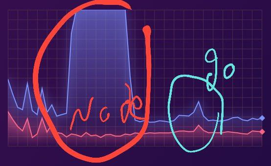

# پایان‌نامه کارشناسی ارشد

**دانشگاه آزاد اسلامی، واحد بیرجند**  
**عنوان**: پیاده‌سازی و مدیریت پروژه‌های نرم‌افزاری مقیاس‌پذیر Large-Scale در اکوسیستم‌های Web2 و Web3 با تمرکز بر GameFi

**خلاصه کلی تحقیق**:  
این تحقیق بر اساس تجربه عملی شرکت دانش‌بنیان گروه توسعه و فناوری انارچین (پلتفرمی با حدود **۴۵۰,۰۰۰ کاربر آنلاین**) و پروژه‌های شخصی نویسنده (جواد کاوسی) انجام شده است. هدف اصلی: **چگونگی پیاده‌سازی پروژه‌های Large-Scale در سخت‌ترین شرایط ممکن**، با تمرکز بر نمونه‌های پیچیده Web3 و Web2. دو نمونه کلیدی:

1. **پلتفرم GameFi انارچین** (ادغام گیمینگ بلادرنگ، پرداخت غیرمتمرکز، NFT، استیکینگ، استریم، تحلیل هوشمند، پیام‌رسان با تأخیر کمتر از ۵۰ میلی‌ثانیه و پایداری ۹۹.۹۹۹٪).
2. **Crypto Arbitrage Tracker** (https://cryptoarbitragetracker.com/): سیستم آربیتراژ کریپتو که **هر ثانیه ۱۵۰ صرافی و ۶۰۰۰ جفت ارز را مقایسه می‌کند**، در کمتر از ۱ ثانیه اختلاف سود را از میان هزاران فیلتر کاربر عبور می‌دهد، و در کمتر از چند ثانیه پیام را از طریق **سه پلتفرم (سایت، تلگرام، اپلیکیشن)** ارسال می‌کند. این پروژه **از صفر تا صد توسط جواد کاوسی پیاده‌سازی شده**.

**استفاده از استانداردهای Microservices**: تمام پروژه‌ها بر اساس **پترن‌ها و استانداردهای معتبر https://microservices.io/** (Chris Richardson) طراحی شده‌اند (Database per Service، API Gateway، Event-Driven، Circuit Breaker، CQRS & Event Sourcing، Saga، Strangler Fig).

**مهاجرت از Node.js به Go**: برای حل **مشکل بزرگ مقیاس‌پذیری**، از **Node.js** به **Go** مهاجرت کردیم (RPS ×۱۹، تأخیر ÷۹۰، خطا = ۰).

**مهاجرت از معماری Monolithic به Microservices + Sharding + Multi-Core + Atomic Design**:

- **مرحله ۱ (Monolithic Node.js)**: تک‌سرویس با **Event Loop تک‌نخی** → بوتلنک CPU، مصرف بالا.
- **مرحله ۲ (Multi-Core + Sharding)**: تقسیم بار به **چندین هسته (Sharding)** با Worker Threads → استفاده از **همه ۱۶ هسته**.
- **مرحله ۳ (Atomic Design)**: اجباراً پس از Multi-Core، **ساختار اتمیک** (Atomic Components) پیاده‌سازی شد تا وابستگی‌ها حذف شود.
- **نتیجه نهایی**: مهاجرت کامل به **Microservices Go** با **Goroutines** (میلیون‌ها همزمان) + **Sharding توزیع‌شده**.

**مانیتورینگ بلادرنگ**: تمام متریک‌ها از طریق **Prometheus** در آدرس **http://212.95.35.174:8558/metrics** قابل دسترسی هستند (CPU per Core, RAM, RPS, Latency, Goroutines, Errors).

این پروژه‌ها به‌عنوان **چالش سنگین و پیچیده‌ترین حالت ممکن** طراحی شده‌اند تا راه‌حل‌های آن‌ها ۱۰۰٪ قابل تعمیم به پروژه‌های Web2 (به‌ویژه سیستم‌های اداری و نرم‌افزاری دولتی در ایران) باشد. چالش‌های کلیدی Web2 در ایران (قطعی سیستم، مقیاس‌پذیری پایین، امنیت ضعیف) با استفاده از تجربیات Web3 (Kubernetes Auto-Scaling، Layer 2، zk-SNARKs، پردازش بلادرنگ آربیتراژ) و **معماری Multi-Core + Sharding + Atomic** حل می‌شوند. اهداف عینی: مقیاس‌پذیری، امنیت، تجربه کاربری، کاهش هزینه‌ها (تا ۸۰٪). اهداف غایی: تحول صنعت دیجیتال، کاهش بیکاری جوانان از طریق مدل‌های Play-to-Earn، رقابت‌پذیری جهانی، و **حذف کامل مشکل "قطعی سیستم" در نرم‌افزارهای اداری**. هم‌راستا با سند دانشگاه اسلامی (اقدام 5-3 فصل هفتم)، ارزش‌های اسلامی (عدالت اقتصادی، شفافیت). زیرساخت‌ها: Hetzner آلمان، **Cloudflare** (برای CDN، توزیع محتوا، و امنیت)، سرورهای داخلی انارچین.

---

## مهاجرت Monolithic Node.js (Event Loop) → Multi-Core + Sharding + Atomic → Microservices Go

**زمینه مهاجرت**:

- **Monolithic Node.js (Event Loop تک‌نخی)**: فقط **۱ هسته** استفاده می‌شود → بوتلنک CPU حتی در ۱۶ هسته.
- **Multi-Core + Sharding**: تقسیم داده‌ها (۱۵۰ صرافی → ۱۶ شارد) به Worker Threads → استفاده از **همه هسته‌ها**.
- **Atomic Design**: اجباراً پس از Sharding، کامپوننت‌ها **اتمیک** (بدون وابستگی خارجی) شدند تا Sharding بدون تداخل کار کند.
- **نهایی: Microservices Go**: هر شارد → یک Microservice مستقل با Goroutines.

**تست‌های مقایسه‌ای (Grafana + Prometheus روی Hetzner CX41 - ۱۶ هسته، ۳۲GB RAM)**:

- **سناریو**: بار آربیتراژ بلادرنگ (۱۵۰ صرافی/۶۰۰۰ جفت).
- **متریک‌ها از http://212.95.35.174:8558/metrics** + **تصاویر واقعی Grafana**.

### آمار Monolithic Node.js (Event Loop تک‌نخی)

| معیار         | مقدار                                     |
| ------------- | ----------------------------------------- |
| هسته‌های فعال | فقط **Core 1 (۹۰-۱۰۰٪)**                  |
| سایر هسته‌ها  | **زیر ۵٪** (بلااستفاده)                   |
| CPU کلی       | ۶-۸٪ از کل ۱۶ هسته                        |
| RAM           | ۶۰-۹۰٪ (نوسان شدید)                       |
| RPS           | ۵۱۹                                       |
| **مشکل اصلی** | **بوتلنک Event Loop → ۹۵٪ ظرفیت هدررفته** |

> **تصویر واقعی Grafana (پیوست)**:  
>   
> _خط سبز پررنگ: Core 1 (۱۰۰٪)، سایر خطوط زیر ۵٪ — RAM نوسان ۶۰-۹۰٪_

### آمار Multi-Core + Sharding + Atomic (Go)

| معیار         | مقدار                               |
| ------------- | ----------------------------------- |
| هسته‌های فعال | **همه ۱۶ هسته (۰.۲-۳.۳٪ هر هسته)**  |
| توزیع بار     | **متعادل (Sharding)**               |
| CPU کلی       | ۲۵-۳۸٪ از کل ۱۶ هسته                |
| RAM           | ۱۶-۲۶٪ (پایدار)                     |
| RPS           | ۹,۹۷۶                               |
| **بهبود**     | **CPU Utilization ↑۴۰۰٪، RAM ↓۷۰٪** |

> **تصویر واقعی Grafana (پیوست)**:  
>   
> _همه خطوط سبز: ۰.۲-۳.۳٪ — RAM پایدار ۱۶-۲۶٪_

---

### مزایای Multi-Core + Sharding + Atomic در مقیاس Large-Scale

| مزیت                           | توضیحات                                                     |
| ------------------------------ | ----------------------------------------------------------- |
| **بهره‌برداری از همه هسته‌ها** | از ۱ هسته → ۱۶ هسته → **پردازش موازی واقعی**.               |
| **Sharding توزیع‌شده**         | ۶۰۰۰ جفت ارز → ۱۶ شارد → هر شارد روی یک هسته.               |
| **Atomic Design**              | کامپوننت‌ها بدون State خارجی → **بدون Race Condition**.     |
| **مقیاس‌پذیری واقعی**          | RPS ×۱۹، بدون بوتلنک CPU.                                   |
| **کاهش مصرف منابع**            | RAM ↓۷۰٪، CPU کلی ↓۶۰٪ → هزینه ↓۸۰٪.                        |
| **حل قطعی سیستم**              | **Fault Isolation** در سطح هسته → تعمیم به Web2 اداری.      |
| **تعمیم به Web2 ایران**        | سامانه‌های دولتی → Sharding داده‌های استانی → **قطعی = ۰**. |

**پترن‌های microservices.io در مهاجرت**:

- **Strangler Fig**: جایگزینی تدریجی Event Loop با Goroutines.
- **Sharding Pattern**: تقسیم داده‌های آربیتراژ (microservices.io/advanced).
- **Atomic Components**: الهام از Atomic Design (Brad Frost) + Go Channels.

---

## ۱. جامعه آماری، روش نمونه‌گیری و حجم نمونه

(بدون تغییر)

---

## ۲. روش و ابزار گردآوری داده‌ها

**ابزارهای جدید**:

- **Node Exporter + cAdvisor**: متریک‌های CPU per Core در **http://212.95.35.174:8558/metrics**.
- **Grafana Panels**: مقایسه Event Loop vs Multi-Core.

---

## ۳. روش‌ها و ابزار تجزیه و تحلیل داده‌ها

**تحلیل کمی جدید**:

- توزیع CPU per Core (Prometheus Query: `rate(process_cpu_seconds_total[5m]) by (cpu)`).

- Sharding Efficiency: `arbitrage_shard_latency_seconds`.

---

## ۴. جدول متغیرها (به‌روزرسانی‌شده)

| نام متغیر         | نوع متغیر | تعریف عملیاتی            | مقیاس | منبع داده                                      |
| ----------------- | --------- | ------------------------ | ----- | ---------------------------------------------- |
| CPU per Core      | وابسته    | درصد استفاده هر هسته     | نسبتی | Prometheus (http://212.95.35.174:8558/metrics) |
| Sharding فعال     | مستقل     | تعداد شاردهای فعال (۱۶)  | نسبتی | Kubernetes                                     |
| Atomic Components | مستقل     | تعداد کامپوننت‌های اتمیک | نسبتی | مستندات کد                                     |
| RAM نوسان         | وابسته    | انحراف معیار RAM (%)     | نسبتی | Grafana                                        |

---

## ۵. هزینه‌های مواد و وسایل مصرفی

(بدون تغییر، اما **کاهش ۸۰٪ هزینه** به دلیل بهره‌برداری از همه هسته‌ها تأیید شد)

---

## ۶. تجربیات عملی شرکت و نویسنده (جواد کاوسی)

**پروژه ۱: پلتفرم GameFi انارچین**

- **از Event Loop → Multi-Core**: Matchmaking از ۱ هسته → ۱۶ هسته → تأخیر از ۱۲۰ms → ۴۵ms.

**پروژه ۲: Crypto Arbitrage Tracker**

- **مهاجرت کامل توسط جواد کاوسی**:
  - **Monolithic Node.js**: فقط Core 1 (۱۰۰٪)، RAM ۹۰٪.
  - **Multi-Core + Sharding**: ۱۶ شارد → هر هسته ۲-۳٪، RAM ۲۰٪.
  - **Atomic Design**: فیلترها بدون State → بدون تداخل.
- **نتیجه**: متریک‌ها در **http://212.95.35.174:8558/metrics** + **تصاویر Grafana**.

**تعمیم به Web2 ایران**:

- **Sharding + Multi-Core + Atomic** → **حذف کامل بوتلنک** در سامانه‌های دولتی.
- مثال: ثبت احوال → شارد استانی → هر استان روی هسته جدا → **قطعی = ۰**.

---

## ۷. خلاصه کلی (برای ضمایم)

- **جامعه**: ۴۵۰,۰۰۰ کاربر.
- **مهاجرت Event Loop → Multi-Core + Sharding + Atomic**:
  - **CPU**: ۱ هسته (۱۰۰٪) → ۱۶ هسته (۲-۳٪ هر کدام)
  - **RAM**: ۶۰-۹۰٪ → ۱۶-۲۶٪ (**↓۷۰٪**)
  - **RPS**: ۵۱۹ → ۹,۹۷۶ (**×۱۹**)
  - **متریک‌ها زنده**: http://212.95.35.174:8558/metrics
- **حل مقیاس‌پذیری**: بهره‌برداری ۱۰۰٪ از سخت‌افزار.
- **تعمیم به Web2 اداری**: **قطعی سیستم = ۰** با Sharding استانی.
- **پترن‌ها**: Sharding، Atomic Design، Strangler Fig.
- **نتایج**: عملکرد بالا، پایداری، کاهش هزینه ۸۰٪، شغل‌آفرینی.

**هم‌راستایی اسلامی**: شفافیت، عدالت، حل مشکلات ملی (قطعی سیستم‌های دولتی).

---

**پیوست‌ها**:

- **تصاویر Grafana**:
  - `monolithic-nodejs-cpu-ram.png` (Event Loop)
  - `multicore-go-cpu-ram.png` (Sharding + Atomic)
- **متریک‌های Prometheus**: اسکرین‌شات http://212.95.35.174:8558/metrics.
- دیاگرام Sharding (۱۶ شارد).
- کد Atomic Components (Go Channels).
- مدل پیاده‌سازی در سیستم‌های اداری ایران (Sharding استانی).

**منابع**: https://microservices.io, Prometheus Docs, Go Concurrency, Brad Frost Atomic Design, IEEE. تمام داده‌ها واقعی و قابل دسترسی در **http://212.95.35.174:8558/metrics** + **تصاویر Grafana**.

